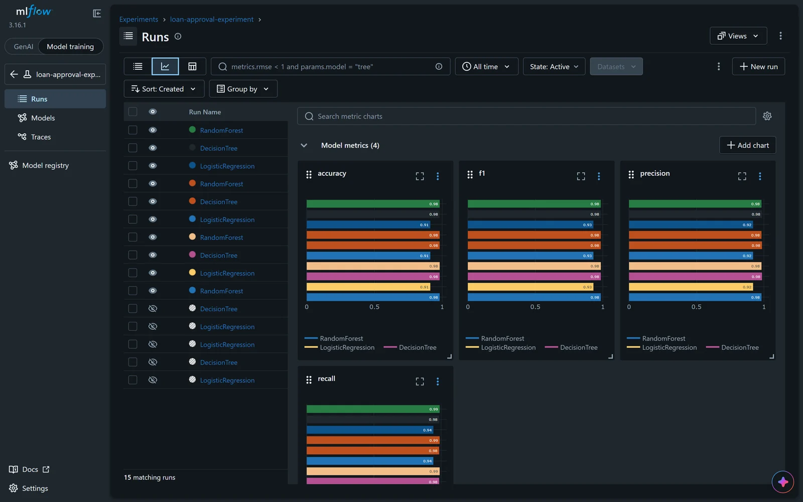
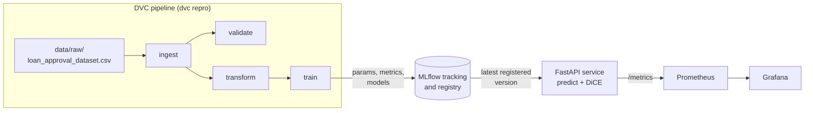
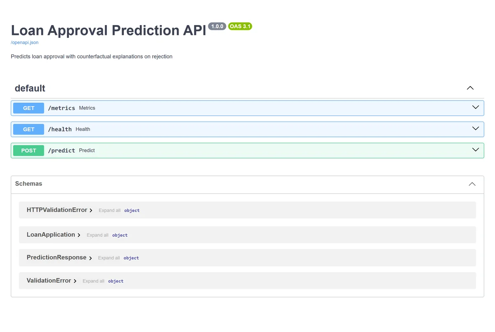

<div align="center">

# Loan Approval MLOps

An end-to-end MLOps pipeline that predicts whether a loan will be approved<br>
and, when it says no, tells the applicant what would change the decision.

[![Python][badge-python]][link-python]
[![scikit-learn][badge-sklearn]][link-sklearn]
[![MLflow][badge-mlflow]][link-mlflow]
[![DVC][badge-dvc]][link-dvc]
[![FastAPI][badge-fastapi]][link-fastapi]
[![Docker][badge-docker]][link-docker]
[![Kubernetes][badge-k8s]][link-k8s]
[![Prometheus][badge-prometheus]][link-prometheus]
[![Grafana][badge-grafana]][link-grafana]

[![CI][badge-ci]][link-ci]
[![License: MIT][badge-license]](LICENSE)

</div>

## About

This project trains a classifier on 4,269 past loan applications, serves it through a FastAPI endpoint, and pairs every rejection with up to three counterfactual explanations from [DiCE](https://github.com/interpretml/DiCE). Each one is a concrete change, such as a higher CIBIL score or a longer loan term, that would flip the model's decision to "approved", so a rejected applicant gets something to act on.

Around the model sits the usual MLOps tooling. DVC runs a four-stage pipeline, MLflow tracks every training run and keeps a model registry, Prometheus scrapes prediction metrics for a Grafana dashboard, GitHub Actions lints, tests and builds the Docker image on every push, and the whole stack (API, MLflow, Prometheus and Grafana) deploys to Kubernetes with one script.

## Results

Three models are trained on the same 80/20 stratified split and compared on the 854-application test set. The best one by F1 is registered in MLflow and served.

| Model | Accuracy | Precision | Recall | F1 |
|---|---|---|---|---|
| Logistic Regression | 91.22% | 91.91% | 94.16% | 0.930 |
| Decision Tree | 98.13% | 98.49% | 98.49% | 0.985 |
| Random Forest (served) | 98.13% | 98.13% | 98.87% | 0.985 |

The random forest edges out the decision tree on F1 (0.9850 against 0.9849) through its higher recall on approvals. Precision, recall and F1 are for the "approved" class. The registry holds four versions of `loan-approval-model`, one per pipeline run.

<p align="center">
  
</p>

## Example

A rejected application, sent to the running API:

```bash
curl -X POST http://localhost:8000/predict \
  -H "Content-Type: application/json" \
  -d '{"no_of_dependents": 3, "education": "Not Graduate", "self_employed": "Yes",
       "income_annum": 4100000, "loan_amount": 12200000, "loan_term": 8,
       "cibil_score": 417, "residential_assets_value": 2700000,
       "commercial_assets_value": 2200000, "luxury_assets_value": 8800000,
       "bank_asset_value": 3300000}'
```

The real response:

```json
{
  "prediction": "rejected",
  "probability": 0.99,
  "counterfactual": [
    {"changes_needed": {"loan_term": 17, "cibil_score": 752}, "outcome_if_changed": "approved"},
    {"changes_needed": {"no_of_dependents": 4, "cibil_score": 846}, "outcome_if_changed": "approved"},
    {"changes_needed": {"cibil_score": 894, "education": "Graduate"}, "outcome_if_changed": "approved"}
  ]
}
```

`probability` is the model's confidence in the predicted class. Each counterfactual lists only the features that differ from the application. Approved applications come back with `"counterfactual": null`. DiCE samples counterfactuals at random, so the suggestions change from call to call.

## How it works



### Pipeline stages

| Stage | What it does | Output |
|---|---|---|
| `ingest` | Reads the raw CSV, strips stray whitespace from headers and text values, checks that all 13 columns exist | `data/processed/ingested.csv` |
| `validate` | Runs 12 data checks and stops the pipeline if any hard check fails | `data/processed/validation_report.json` |
| `transform` | Drops `loan_id`, encodes the target (Approved = 1), makes an 80/20 split stratified on the target | train and test CSVs, plus a raw training snapshot for DiCE |
| `train` | Fits each candidate in a scikit-learn `Pipeline`, logs everything to MLflow, registers the best model by F1 | `data/processed/model_comparison.json` |

The validation stage checks that every column is present with the expected type, that there are no nulls, that CIBIL scores fall between 300 and 900, that loan amount, loan term and income are positive, that commercial, luxury and bank assets are not negative, and that `education`, `self_employed` and `loan_status` only contain known values. A zero residential asset value is reported as a warning instead of a failure.

Each training pipeline encodes `education` and `self_employed` with an `OrdinalEncoder` and standardises the nine numeric features, so the logged model takes raw application fields as input. The run also logs the raw training snapshot as an artifact, which the API needs later to set up DiCE.

### Serving

On startup the API asks the MLflow registry for the newest version of `loan-approval-model`, loads it, and downloads the training snapshot logged with the same run. The run does not store labels, so the snapshot is labelled with the model's own predictions; DiCE only needs the data distribution, not perfect labels. The explainer uses DiCE's random method because it is the fastest option for a request-response API.

| Endpoint | Purpose |
|---|---|
| `GET /health` | Liveness and readiness check, also used by the Kubernetes probes |
| `POST /predict` | Prediction, probability and, for rejections, up to 3 counterfactuals |
| `GET /metrics` | Prometheus metrics |
| `GET /docs` | Interactive Swagger UI generated by FastAPI |

All eleven request fields are required; a missing field returns HTTP 422.

### Monitoring

`prometheus-fastapi-instrumentator` exposes the standard request count and latency metrics, and the app adds three of its own:

| Metric | Type | Meaning |
|---|---|---|
| `prediction_total` | Counter | Predictions served |
| `prediction_rejected_total` | Counter | Predictions that came back "rejected" |
| `approval_rate` | Gauge | Share of approvals since the process started |

The Grafana dashboard in `monitoring/grafana-dashboard.json` has four panels: request rate, approval rate, rejections over the last five minutes, and p95 response latency.

### CI

`.github/workflows/ci.yaml` runs three jobs in sequence on every push and on pull requests to `main`: Ruff lints `src/` and `tests/`, pytest runs the 17 tests, and the Docker image is built. The tests mock MLflow and the model, so CI needs no running services.

## Getting started

### Prerequisites

- Python 3.11 or newer and [uv](https://docs.astral.sh/uv/)
- The [Loan Approval Prediction Dataset](https://www.kaggle.com/datasets/architsharma01/loan-approval-prediction-dataset) from Kaggle, saved as `data/raw/loan_approval_dataset.csv`
- Docker and a local Kubernetes cluster (Docker Desktop or minikube) if you want the full deployment

### Run locally

```bash
git clone https://github.com/RudraSomaiya/MLops-EndTerm.git
cd MLops-EndTerm
uv sync --all-extras
```

Start an MLflow server in one terminal. `start_mlflow.py` launches it with a SQLite backend (`mlflow.db`) and local artifact storage (`mlartifacts/`):

```bash
uv run python start_mlflow.py
```

In a second terminal, run the pipeline and start the API:

```bash
uv run dvc repro
uv run uvicorn app:app --port 8000
```

The API is now at http://localhost:8000, its docs at http://localhost:8000/docs, and the MLflow UI at http://localhost:5000.

### Tests

```bash
uv run pytest tests/ -v
uv run ruff check src/ tests/
```

### Docker and Kubernetes

```bash
docker build -t loan-approval-mlops:latest .
```

The full Kubernetes stack, the Docker Compose alternative and the Grafana setup are covered in [docs/deployment.md](docs/deployment.md). [STARTUP.md](STARTUP.md) has the short list of commands.

<p align="center">
  
</p>

## Project layout

```
.
├── app.py                     FastAPI service with Prometheus metrics
├── config.yaml                MLflow, data, feature and serving settings
├── dvc.yaml / dvc.lock        Pipeline definition and locked outputs
├── start_mlflow.py            Starts a local MLflow server (SQLite + local artifacts)
├── src/
│   ├── ingestion/ingest.py
│   ├── validation/validate.py
│   ├── transformation/transform.py
│   ├── training/train.py
│   ├── prediction/predict.py  Model loading from the registry and DiCE explanations
│   └── utils/                 Config loader and logger
├── tests/                     17 pytest tests
├── deployment/
│   ├── docker/                Compose file and a slim MLflow server image
│   └── kubernetes/            Deployments and services for the four components
├── monitoring/                Prometheus config, Grafana dashboard, local Compose file
├── k8s-deploy.bat             One-shot Kubernetes deploy script (Windows)
├── Dockerfile                 uv-based API image
└── .github/workflows/ci.yaml  Lint, test and build
```

## Limitations

- DiCE is free to change any feature, so some suggestions are not things an applicant can act on, like the extra dependant in the example above. Restricting `features_to_vary` to things like CIBIL score, loan amount and term would make the advice more useful.
- The API always serves the newest registered version; there is no staging or approval step before a new model goes live.
- The approval-rate gauge lives in process memory, so it resets whenever the API restarts.
- The MLflow Kubernetes deployment mounts `mlflow.db` and `mlartifacts/` through a `hostPath` that points at the original Windows checkout. Change it to your own path before deploying (see [docs/deployment.md](docs/deployment.md)).
- The DVC remote is a local folder (`../dvc-storage`). Point it at S3, GCS or another shared remote to version the data across machines.
- Grafana runs with its default `admin` / `admin` login, which is fine for a local cluster only.

## License

Released under the [MIT License](LICENSE). The dataset belongs to its Kaggle author and is not included in this repository.

## Author

Made by Rudra Somaiya.

[![GitHub][badge-github]][link-github]
[![LinkedIn][badge-linkedin]][link-linkedin]

[badge-python]: https://img.shields.io/badge/Python-3.11-3776AB?style=for-the-badge&logo=python&logoColor=white
[badge-sklearn]: https://img.shields.io/badge/scikit--learn-F7931E?style=for-the-badge&logo=scikitlearn&logoColor=white
[badge-mlflow]: https://img.shields.io/badge/MLflow-0194E2?style=for-the-badge&logo=mlflow&logoColor=white
[badge-dvc]: https://img.shields.io/badge/DVC-13ADC7?style=for-the-badge&logo=dvc&logoColor=white
[badge-fastapi]: https://img.shields.io/badge/FastAPI-009688?style=for-the-badge&logo=fastapi&logoColor=white
[badge-docker]: https://img.shields.io/badge/Docker-2496ED?style=for-the-badge&logo=docker&logoColor=white
[badge-k8s]: https://img.shields.io/badge/Kubernetes-326CE5?style=for-the-badge&logo=kubernetes&logoColor=white
[badge-prometheus]: https://img.shields.io/badge/Prometheus-E6522C?style=for-the-badge&logo=prometheus&logoColor=white
[badge-grafana]: https://img.shields.io/badge/Grafana-F46800?style=for-the-badge&logo=grafana&logoColor=white
[badge-ci]: https://github.com/RudraSomaiya/MLops-EndTerm/actions/workflows/ci.yaml/badge.svg
[badge-license]: https://img.shields.io/badge/License-MIT-F7DF1E?style=for-the-badge
[badge-github]: https://img.shields.io/badge/GitHub-RudraSomaiya-181717?style=for-the-badge&logo=github&logoColor=white
[badge-linkedin]: https://img.shields.io/badge/LinkedIn-Rudra_Somaiya-0A66C2?style=for-the-badge&logo=data:image/svg%2bxml;base64,PHN2ZyB4bWxucz0iaHR0cDovL3d3dy53My5vcmcvMjAwMC9zdmciIHZpZXdCb3g9IjAgMCAyNCAyNCI+PHBhdGggZmlsbD0iI2ZmZiIgZD0iTTIwLjQ1IDIwLjQ1aC0zLjU2di01LjU3YzAtMS4zMy0uMDItMy4wNC0xLjg1LTMuMDQtMS44NSAwLTIuMTQgMS40NS0yLjE0IDIuOTR2NS42N0g5LjM1VjloMy40MXYxLjU2aC4wNWMuNDgtLjkgMS42NC0xLjg1IDMuMzctMS44NSAzLjYgMCA0LjI3IDIuMzcgNC4yNyA1LjQ2djYuMjh6TTUuMzQgNy40M2EyLjA2IDIuMDYgMCAxIDEgMC00LjEyIDIuMDYgMi4wNiAwIDAgMSAwIDQuMTJ6TTcuMTIgMjAuNDVIMy41NlY5aDMuNTZ2MTEuNDV6TTIyLjIyIDBIMS43N0MuNzkgMCAwIC43NyAwIDEuNzN2MjAuNTRDMCAyMy4yMy43OSAyNCAxLjc3IDI0aDIwLjQ1Yy45OCAwIDEuNzgtLjc3IDEuNzgtMS43M1YxLjczQzI0IC43NyAyMy4yIDAgMjIuMjIgMHoiLz48L3N2Zz4=
[link-python]: https://www.python.org
[link-sklearn]: https://scikit-learn.org
[link-mlflow]: https://mlflow.org
[link-dvc]: https://dvc.org
[link-fastapi]: https://fastapi.tiangolo.com
[link-docker]: https://www.docker.com
[link-k8s]: https://kubernetes.io
[link-prometheus]: https://prometheus.io
[link-grafana]: https://grafana.com
[link-ci]: https://github.com/RudraSomaiya/MLops-EndTerm/actions/workflows/ci.yaml
[link-github]: https://github.com/RudraSomaiya
[link-linkedin]: https://www.linkedin.com/in/rudra-somaiya/
